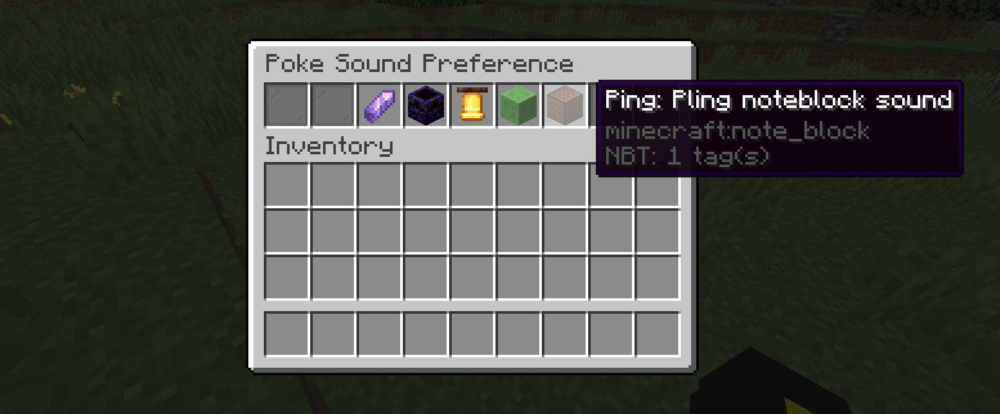

<p align="center">

</p>
<h1 align="center">
Poke
</h1>

---
A Minecraft plugin which allows players to `ping (@)` each other in game.

>Versions: 1.17+ Compatible (Spigot Servers)

## `Usage:` Poking other players
```
Players can write @<playername> to send a sound that will be
played to the player recieving the ping.
``` 

s
## Poke Cooldown
```(config.yml)```
```
Server owners can edit the plugin config to change the cooldown 
between pokes. To do this, go into the config file, and change 
the "cooldown" value.
``` 

## Sound change
```
Players can use the command /poke to change their preffered sound 
for getting poked. (GUI menu to change sounds) 
``` 

>Note: Player settings do not get saved after the server is shut down!


